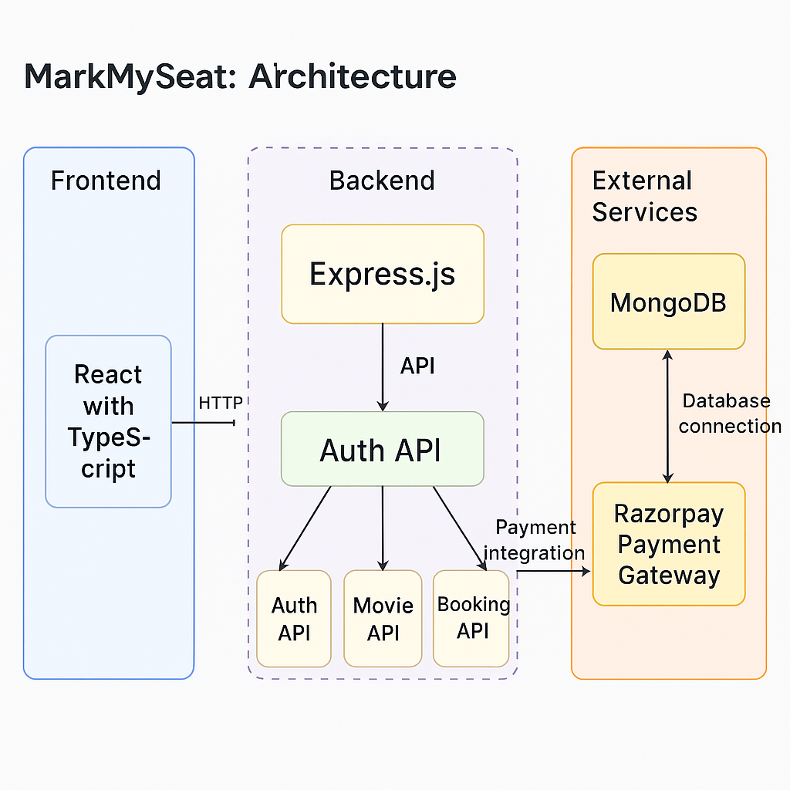

Perfect, Akash 👏

Here’s your **fully enhanced, visually consistent, and professional README.md**, updated to include **both versions — v1 (Jenkins + AWS)** and **v2 (Render + Netlify)**.

It keeps your original structure, badges, emojis, and formatting, but with clean sectioning and improved clarity so it looks *premium and portfolio-ready*.

You can copy this directly into your project’s root as `README.md`.

---

```markdown
# 🎟️ MarkMySeat — Full-Stack Movie Ticket Booking App


---

**MarkMySeat** is a complete **BookMyShow-like** movie ticket booking platform built with the **MERN Stack**.  
It supports **JWT Authentication**, **Real-Time Seat Selection**, and **Razorpay Payment Integration**.  

This project has evolved in **two major versions**:  
- 🚀 **v1** — CI/CD with **Jenkins + AWS EC2 + Nginx + PM2**  
- ☁️ **v2** — Cloud-Native with **Render + Netlify + MongoDB Atlas**

---

## 📦 Versions Overview

| Version | Description | Tech Highlights |
|----------|--------------|----------------|
| **v1 (AWS CI/CD)** | Full DevOps setup with Jenkins, Nginx, and PM2 on AWS EC2 | Automated build + deploy pipeline |
| **v2 (Cloud Deployment)** | Lightweight, fully-managed deployment using Render + Netlify | Zero-maintenance, globally accessible |

---

## 🌐 Live Demos

### 🎯 **v2 — Cloud-Native Deployment**
- 🔗 **Frontend (Netlify):** [https://markmyseat.netlify.app](https://markmyseat.netlify.app)  
- 🔗 **Backend (Render):** [https://markmyseat.onrender.com](https://markmyseat.onrender.com)  
- 💾 **Database:** MongoDB Atlas  

### ☁️ **v1 — Jenkins + AWS CI/CD**
- 🔗 **Live Instance:** [http://51.21.27.2](http://51.21.27.2)  
- 📦 Deployed using Jenkins Pipeline on AWS EC2 with Nginx & PM2

---

## ✨ Features

- ✅ Secure User Authentication (JWT)
- ✅ Dynamic Movie & Show Management
- ✅ 🎟️ Real-Time Seat Selection (Max 8 per user)
- ✅ Razorpay Integrated Payment Gateway
- ✅ Payment Signature Verification
- ✅ Booking History & Show Management
- ✅ Responsive UI (Tailwind CSS)
- ✅ CI/CD (v1: Jenkins, v2: Render + Netlify)
- 🛠️ Admin Panel (Coming Soon...)

---

## 🛠 Tech Stack

| Frontend                | Backend               | DevOps & Cloud             |
|--------------------------|------------------------|-----------------------------|
| React + TypeScript       | Node.js + Express       | AWS EC2, Jenkins (v1) |
| Tailwind CSS, Axios      | MongoDB + Mongoose      | Render + Netlify (v2) |
| React Router, Context API | JWT, bcrypt, Razorpay  | PM2, Nginx, GitHub Actions |

---

## 📂 Folder Structure

```

MarkMySeat/
├── client/                         # React frontend (TypeScript)
│   ├── src/
│   └── .env                        # API URL, Razorpay key
├── server/                         # Express backend
│   ├── controllers/, models/, routes/
│   └── .env                        # MongoDB, JWT, Razorpay secrets
├── docs/                           # Documentation & Diagrams
│   └── markmyseat-architecture.png # Architecture Diagram
├── Jenkinsfile                     # CI/CD Pipeline (v1)
├── .gitignore
└── README.md

````

---

## ⚙️ Environment Variables

### `/client/.env`
```env
REACT_APP_RAZORPAY_KEY_ID=addyours
REACT_APP_API_URL=addyours
````

### `/server/.env`

```env
PORT=8080
MONGO_URI=your_mongodb_connection_string
JWT_SECRET=supersecurejwtkey
RAZORPAY_KEY_ID=addyours
RAZORPAY_KEY_SECRET=addyours
```

---

## 🧑‍💻 Local Development Setup

### 1️⃣ Clone the Repository

```bash
git clone https://github.com/akashgupta-git/MarkMySeat.git
cd MarkMySeat
```

### 2️⃣ Install Dependencies

```bash
# Frontend
cd client
npm install

# Backend
cd ../server
npm install
```

### 3️⃣ Setup Environment Variables

Create `.env` files in both `client/` and `server/` as shown above.

### 4️⃣ Run Locally

```bash
# Backend
cd server
npm start

# Frontend
cd ../client
npm start
```

App runs at:

* 🌐 Frontend → [http://localhost:3000](http://localhost:3000)
* ⚙️ Backend → [http://localhost:8080](http://localhost:8080)

---

## ☁️ Deployment Details

### 🚀 **Version 1: Jenkins + AWS EC2 (DevOps-Oriented)**

* CI/CD pipeline built using Jenkins
* Webhook triggers build on every Git push
* Jenkins pulls latest code, builds frontend, restarts backend via PM2
* Nginx reverse-proxies requests to backend
* MongoDB Atlas serves as remote database

#### 🔧 Stack

* Jenkins (CI/CD Automation)
* AWS EC2 (Compute Instance)
* PM2 (Backend Process Manager)
* Nginx (Reverse Proxy)
* MongoDB Atlas (Cloud DB)

---

### ☁️ **Version 2: Render + Netlify (Cloud-Native)**

* Render hosts backend Node.js server + MongoDB connection
* Netlify hosts React frontend globally via CDN
* Auto deploys on every GitHub commit (CI/CD)
* Environment variables managed securely on both platforms
* HTTPS + Auto Scaling + Zero Maintenance

#### 🔧 Stack

* Render (Backend + API Hosting)
* MongoDB Atlas (Cloud Database)
* Netlify (Frontend Hosting)
* Razorpay (Payment Gateway)
* GitHub (Source & Deployment Trigger)

---

## 💳 Razorpay Payment Integration

* 🔹 Razorpay Order generated via backend API
* 🔹 Frontend initiates secure payment flow
* 🔹 Backend verifies payment signature using HMAC SHA256
* 🔹 Successful transactions create a booking record in MongoDB

---

## 🏗️ System Architecture

### 🔹 **Version 1 (Jenkins + AWS + Nginx + PM2)**



**Flow:**

1. Jenkins CI/CD pulls and builds project on EC2
2. PM2 runs backend; Nginx serves frontend + proxies backend
3. MongoDB Atlas handles data persistence
4. Razorpay manages secure payments

---

### 🔹 **Version 2 (Render + Netlify + MongoDB Atlas)**


**Flow:**

1. User accesses frontend on **Netlify**
2. Frontend sends API requests to **Render backend**
3. Backend connects securely to **MongoDB Atlas**
4. Payments handled by **Razorpay SDK**
5. Continuous deployments triggered via **GitHub commits**

---

## 🔐 Security Features

* 🔒 Passwords hashed using bcrypt
* 🔑 JWT-based Authentication
* 💳 Razorpay Signature Verification
* ⚙️ CORS Protection for allowed domains
* 🧩 Secrets managed via `.env` (ignored in `.gitignore`)
* 🧠 GitGuardian active for key leak prevention

---

## 🧱 Architecture Highlights

* Modular MVC backend structure
* Protected routes via JWT middleware
* Context API for authentication in React
* Tailwind-based responsive UI
* CI/CD automation (v1) + Cloud-native auto-deploy (v2)

---

## 🧠 Future Enhancements

* 🛠️ Admin Dashboard for Movies/Shows
* 📩 Email Confirmation after Booking
* 🎫 PDF Ticket Generation
* 📊 Analytics Dashboard for Admin
* 💬 Real-Time Chat Support
* 🔔 Push Notifications

---

## ✨ Developed By

**Akash Gupta**
💼 B.Tech CSE | Full Stack & Cloud Enthusiast
🌐 [GitHub](https://github.com/akashgupta-git)
💬 [LinkedIn](https://www.linkedin.com/in/akashgupta-git)

---

## 📄 License

This project is licensed under the **MIT License**.

---

## 🙌 Show Your Support

⭐ Star this repo to support the project
🛠️ Fork it to build your own version
📩 PRs are welcome to enhance features!

---

